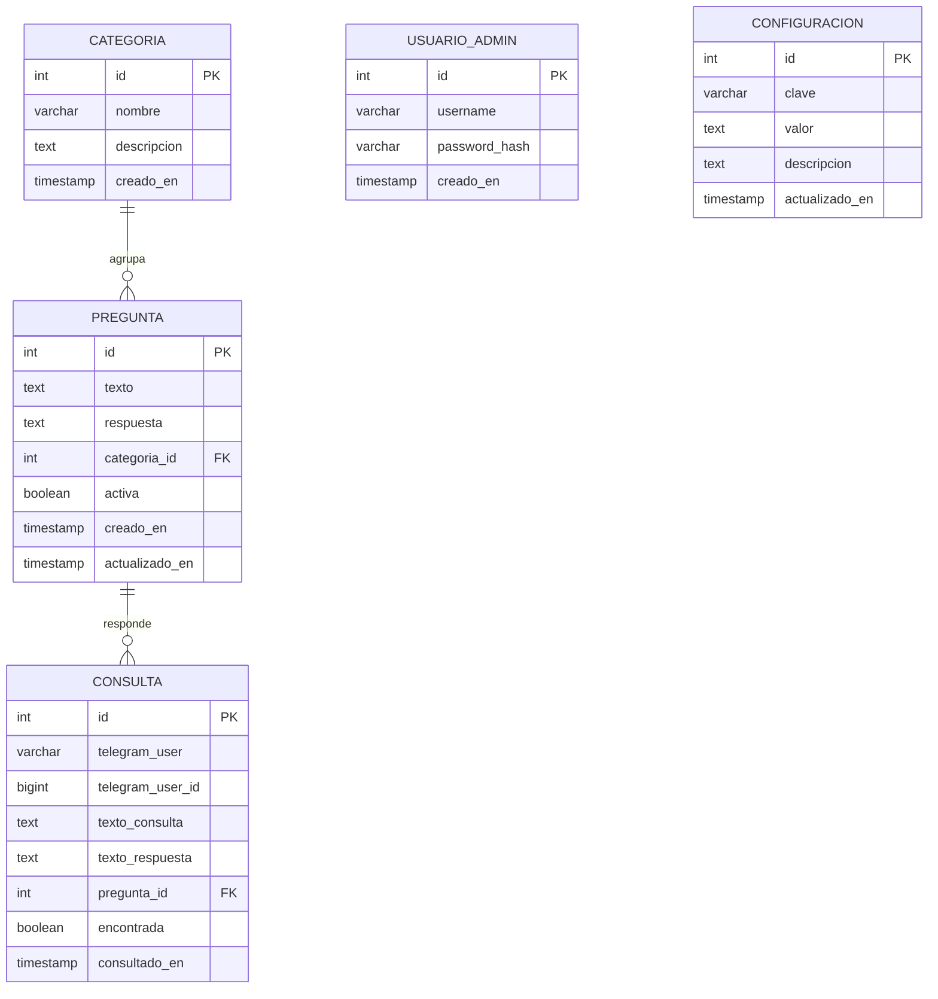

# Arquitectura del Sistema - SmartBot

## 1. Descripcion general

SmartBot es un sistema de respuestas automatizadas compuesto por tres componentes principales que se comunican a traves de una API REST:

- **Bot de Telegram**: recibe mensajes de los usuarios y consulta la API para obtener respuestas.
- **API REST (FastAPI)**: nucleo del sistema; gestiona preguntas, respuestas, categorias, autenticacion y estadisticas.
- **Panel administrativo web**: interfaz HTML/CSS/JS que consume la API para la gestion de contenido.

Todos los componentes se ejecutan dentro de contenedores Docker orquestados con Docker Compose.

---

## 2. Patron de arquitectura

Se utiliza una arquitectura de **capas (Layered Architecture)** combinada con el patron **API Gateway**:

```
[Usuario Telegram]              [Administrador]
        |                              |
        v                             v
  [Bot Telegram]            [Panel Web (HTML/JS)]
        |                             |
        +-----------> [API REST] <----+
                           |
                    [Base de datos]
                     (PostgreSQL)
```

- **Capa de presentacion**: bot de Telegram y panel web. Ambos son clientes de la API.
- **Capa de negocio**: API REST implementada con FastAPI. Contiene toda la logica de busqueda, autenticacion y estadisticas.
- **Capa de datos**: PostgreSQL accedida unicamente a traves de SQLAlchemy desde la API. Ningun cliente accede directamente a la base de datos.

El patron API Gateway garantiza que:
- Toda la logica de negocio esta centralizada en un solo punto.
- Las preguntas y respuestas jamas estan hardcodeadas; siempre vienen de la BD.
- El estado del bot (activo/inactivo) se verifica en la API antes de procesar cada consulta.

---

## 3. Stack tecnologico

| Componente         | Tecnologia                       |
|--------------------|----------------------------------|
| Backend / API REST | Python 3.11 + FastAPI            |
| Base de datos      | PostgreSQL 16                    |
| Bot                | python-telegram-bot 21           |
| Panel admin        | HTML5 + CSS3 + JavaScript        |
| Autenticacion      | JWT (python-jose + passlib/bcrypt)|
| Orquestacion       | Docker + Docker Compose          |
| Control de versiones | Git + GitHub                   |

---

## 4. Estructura del proyecto

```
smartbot/
├── backend/
│   ├── app/
│   │   ├── main.py            # Punto de entrada FastAPI, seed admin, monta static
│   │   ├── config.py          # Variables de entorno con pydantic-settings
│   │   ├── database.py        # Engine y sesion SQLAlchemy
│   │   ├── models.py          # Modelos ORM
│   │   ├── schemas.py         # Esquemas Pydantic (request/response)
│   │   ├── auth.py            # JWT y dependencias de autenticacion
│   │   └── routers/
│   │       ├── categorias.py      # CRUD categorias
│   │       ├── preguntas.py       # CRUD preguntas
│   │       ├── consultas.py       # /consultar + /consultas (historial)
│   │       ├── configuracion.py   # GET/PUT parametros del sistema
│   │       └── estadisticas.py    # Totales y rankings
│   ├── bot/
│   │   └── telegram_bot.py    # Proceso del bot (consume la API)
│   ├── requirements.txt
│   └── Dockerfile
├── admin/                     # Panel web estatico
│   ├── login.html
│   ├── index.html
│   ├── css/styles.css
│   └── js/app.js
├── db/
│   └── init.sql               # Esquema + seed inicial
├── docs/
├── docker-compose.yml
├── .env.example
└── .gitignore
```

---

## 5. Modelo de datos

### Entidades

| Entidad         | Descripcion                                               |
|-----------------|-----------------------------------------------------------|
| `categoria`     | Agrupa preguntas frecuentes por tema                      |
| `pregunta`      | Pregunta frecuente con su respuesta, asociada a categoria |
| `usuario_admin` | Usuarios con acceso al panel administrativo               |
| `consulta`      | Historial de cada consulta hecha desde Telegram           |
| `configuracion` | Parametros del sistema (chat ID, mensajes, estado bot)    |

### Relaciones

- Una `categoria` agrupa muchas `pregunta` (1:N).
- Una `pregunta` puede tener muchas `consulta` asociadas (1:N).
- `configuracion` almacena pares clave-valor del sistema.

### Diagrama Entidad-Relacion



### Parametros de configuracion

| Clave                 | Valor por defecto | Descripcion                                        |
|-----------------------|-------------------|----------------------------------------------------|
| `telegram_chat_id`    | (vacio)           | ID del grupo/chat para mensajes proactivos         |
| `bot_nombre`          | SmartBot          | Nombre del bot en mensajes                         |
| `mensaje_no_encontrado` | (texto largo)   | Respuesta cuando no hay coincidencia               |
| `bot_activo`          | true              | Si es false el bot rechaza todas las consultas     |

---

## 6. API REST

### Autenticacion

| Metodo | Ruta          | Descripcion                              | Auth |
|--------|---------------|------------------------------------------|------|
| POST   | /auth/login   | Recibe {username, password}, retorna JWT | No   |

Request:
```json
{ "username": "IA1-User", "password": "IA1-password@_new" }
```
Response:
```json
{ "access_token": "<jwt>", "token_type": "bearer" }
```

### Categorias

| Metodo | Ruta                   | Descripcion             | Auth |
|--------|------------------------|-------------------------|------|
| GET    | /categorias            | Lista todas             | No   |
| POST   | /categorias            | Crea una categoria      | Si   |
| PUT    | /categorias/{id}       | Actualiza una categoria | Si   |
| DELETE | /categorias/{id}       | Elimina una categoria   | Si   |

Request POST/PUT:
```json
{ "nombre": "Horarios", "descripcion": "Informacion sobre horarios" }
```

### Preguntas

| Metodo | Ruta               | Descripcion                             | Auth |
|--------|--------------------|----------------------------------------|------|
| GET    | /preguntas         | Lista preguntas (filtro por categoria) | No   |
| POST   | /preguntas         | Crea pregunta con respuesta            | Si   |
| PUT    | /preguntas/{id}    | Actualiza pregunta o respuesta         | Si   |
| DELETE | /preguntas/{id}    | Elimina pregunta                       | Si   |

Request POST/PUT:
```json
{
  "texto": "Cuales son los horarios de atencion?",
  "respuesta": "Atendemos de lunes a viernes de 8:00 a 17:00 horas.",
  "categoria_id": 1,
  "activa": true
}
```

### Consulta del bot

| Metodo | Ruta       | Descripcion                                      | Auth |
|--------|------------|--------------------------------------------------|------|
| POST   | /consultar | Busca respuesta para el texto enviado por el bot | No   |
| GET    | /consultas | Historial de consultas                           | Si   |

Request /consultar:
```json
{ "texto": "cuales son los horarios?", "telegram_user": "pepe", "telegram_user_id": 12345 }
```
Response (con respuesta encontrada):
```json
{ "respuesta": "Atendemos de lunes a viernes...", "encontrada": true, "pregunta_id": 1 }
```
Response (sin respuesta):
```json
{ "respuesta": "Lo siento, no encontre una respuesta...", "encontrada": false, "pregunta_id": null }
```
Response (bot inactivo):
```json
{ "respuesta": "El bot se encuentra temporalmente inactivo. Intenta mas tarde.", "encontrada": false, "pregunta_id": null }
```

### Configuracion

| Metodo | Ruta                    | Descripcion                       | Auth |
|--------|-------------------------|-----------------------------------|------|
| GET    | /configuracion          | Lista todas las configuraciones   | Si   |
| GET    | /configuracion/{clave}  | Obtiene una configuracion         | No   |
| PUT    | /configuracion/{clave}  | Actualiza una configuracion       | Si   |

Ejemplo para activar/desactivar el bot:
```
PUT /configuracion/bot_activo
{ "valor": "false" }
```

### Estadisticas

| Metodo | Ruta           | Descripcion                      | Auth |
|--------|----------------|----------------------------------|------|
| GET    | /estadisticas  | Totales y rankings de consultas  | Si   |

Response:
```json
{
  "total_consultas": 42,
  "consultas_encontradas": 35,
  "consultas_no_encontradas": 7,
  "total_usuarios_unicos": 10,
  "total_preguntas": 23,
  "total_categorias": 5,
  "consultas_por_categoria": [{"categoria": "Horarios", "total": 12}],
  "preguntas_mas_consultadas": [{"pregunta": "Cuales son los horarios?", "total": 8}]
}
```

---

## 7. Bot de Telegram

El bot se implementa con `python-telegram-bot` en modo polling. Flujo de una consulta:

1. El usuario envia un mensaje al bot en Telegram.
2. El handler `manejar_mensaje` captura el texto.
3. El bot realiza `POST /consultar` a la API con el texto y datos del usuario.
4. La API verifica si `bot_activo` es `"true"`. Si es `"false"`, retorna mensaje de inactividad.
5. Si el bot esta activo, busca la pregunta mas similar usando `difflib.SequenceMatcher` (umbral 0.45).
6. Si la similitud supera el umbral, retorna la respuesta almacenada en BD.
7. Si no hay coincidencia, retorna el mensaje configurable `mensaje_no_encontrado`.
8. La API registra la consulta en el historial independientemente del resultado.
9. El bot responde al usuario con el resultado obtenido de la API.

El token del bot se lee exclusivamente desde la variable de entorno `TELEGRAM_TOKEN`.

### Comandos del bot

| Comando  | Descripcion                       |
|----------|-----------------------------------|
| /start   | Mensaje de bienvenida             |
| /ayuda   | Informacion sobre como usar el bot|

---

## 8. Panel administrativo

El panel es una SPA estatica (HTML/CSS/JS vanilla) servida por el mismo contenedor del backend mediante `StaticFiles` de FastAPI.

- La autenticacion se realiza contra `POST /auth/login` y el token JWT se guarda en `sessionStorage`.
- Cada llamada a la API incluye el header `Authorization: Bearer <token>`.
- Si la API retorna 401, se redirige automaticamente a `login.html`.
- Las secciones disponibles son: Estadisticas, Categorias, Preguntas, Historial y Configuracion.

### Feature: Activar/Desactivar Bot

En la seccion Configuracion del panel, la tarjeta de estado del bot muestra:
- Un indicador visual (circulo verde = activo, rojo = inactivo).
- El boton cambia entre "Desactivar bot" y "Activar bot" segun el estado actual.
- Al hacer clic, se realiza `PUT /configuracion/bot_activo` con el valor `"false"` o `"true"`.
- El cambio toma efecto inmediatamente; la proxima consulta al bot usa el nuevo estado.

---

## 9. Docker Compose

El proyecto se levanta con tres servicios:

| Servicio  | Imagen base        | Puerto | Descripcion                          |
|-----------|--------------------|--------|--------------------------------------|
| db        | postgres:16-alpine | -      | Base de datos con carga del init.sql |
| backend   | python:3.11-slim   | 8000   | API REST + panel admin estatico      |
| bot       | python:3.11-slim   | -      | Proceso del bot de Telegram          |

El servicio `backend` espera a que `db` pase el health check antes de iniciar. El servicio `bot` espera a que `backend` este corriendo.

Comando de arranque:
```bash
cp .env.example .env   # completar con valores reales
docker compose up -d
```

Accesos:
- Panel administrativo: http://localhost:8000/login.html
- API REST + docs interactivos: http://localhost:8000/docs
