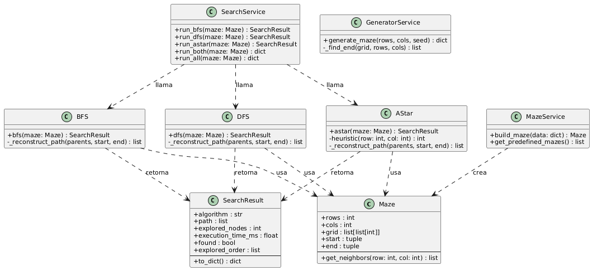
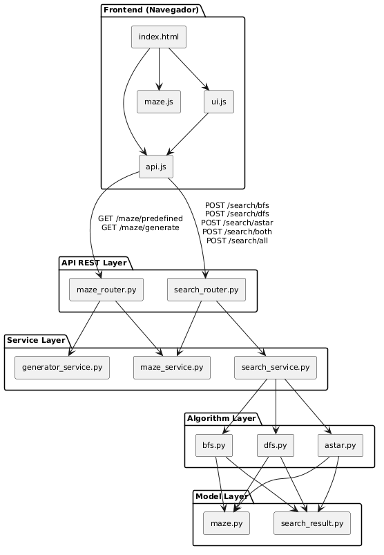

# Manual Tecnico - RoboMaze

**Proyecto:** RoboMaze - Sistema de busqueda de rutas en laberintos  
**Curso:** Inteligencia Artificial 1 - Vacaciones primer semestre 2026  
**Universidad:** Universidad de San Carlos de Guatemala  
**Autor:** Joaquin Emmanuel Aldair Coromac Huezo - 201903873  

---

## Descripcion general del sistema

RoboMaze es un sistema de busqueda de rutas en laberintos virtuales. Permite representar un laberinto como una cuadricula bidimensional donde cada celda puede ser libre u obstaculo, y ejecutar los algoritmos BFS, DFS y A* para encontrar rutas entre una posicion inicial y una posicion objetivo.

El sistema mide longitud de ruta, nodos explorados y tiempo de ejecucion para comparar el comportamiento de cada algoritmo. Incluye ademas generacion automatica de laberintos, modificacion del tamano de la cuadricula, animacion del proceso de exploracion y tabla comparativa de estadisticas.

---

## Patron de arquitectura

### Descripcion del patron de capas (Layered Architecture)

El backend de RoboMaze esta organizado siguiendo el patron de **Arquitectura en Capas** (Layered Architecture), tambien conocido como arquitectura por niveles o N-tier. Este patron divide el sistema en grupos horizontales de modulos, donde cada grupo tiene una responsabilidad bien definida y solo puede comunicarse directamente con la capa inmediatamente inferior.

La regla central del patron es la siguiente: **cada capa conoce a la capa de abajo pero no a la de arriba**. Un router conoce al servicio que llama, pero no sabe quien lo llamo a el. Un algoritmo conoce el modelo que necesita, pero no sabe que servicio lo invoco. Esta restriccion es la que hace que el sistema sea mantenible y extensible.

### Por que se eligio este patron para RoboMaze

Se eligio la arquitectura en capas por tres razones principales:

1. **Separacion de responsabilidades**: la logica de busqueda (BFS, DFS, A*) esta completamente separada de la logica de negocio (servicios), de la exposicion HTTP (routers) y de las estructuras de datos (modelos). Esto permite modificar o reemplazar cualquiera de esas partes sin afectar las demas.

2. **Facilidad de extension**: agregar un nuevo algoritmo de busqueda (por ejemplo, Dijkstra) solo requiere crear un modulo en `algorithms/`, agregar una funcion en `search_service.py` y registrar un endpoint en `search_router.py`. El resto del sistema permanece sin cambios.

3. **Claridad en el flujo**: el recorrido de una peticion siempre sigue la misma direccion (Router → Service → Algorithm → Model), lo que facilita la lectura del codigo y la deteccion de errores.

### Capas del backend

El backend tiene cuatro capas, de superior a inferior:

#### 1. API REST Layer (Capa de routers)

**Modulos:** `maze_router.py`, `search_router.py`

Es la capa de entrada del sistema. Recibe las peticiones HTTP del frontend, valida el formato de los datos usando modelos Pydantic, y delega el trabajo a la capa de servicios. No contiene ninguna logica de negocio ni conoce los detalles de los algoritmos. Su unica responsabilidad es traducir HTTP a llamadas de Python y devolver la respuesta en JSON.

Ejemplo de responsabilidad: cuando llega `POST /search/bfs`, el router valida que el cuerpo tenga `rows`, `cols`, `grid`, `start` y `end`, llama a `run_bfs()` del servicio, y retorna el resultado serializado. Nada mas.

#### 2. Service Layer (Capa de servicios)

**Modulos:** `maze_service.py`, `generator_service.py`, `search_service.py`

Es la capa de logica de negocio. Orquesta las operaciones: construye instancias de `Maze` a partir de datos crudos, decide que algoritmo invocar, combina resultados cuando se piden comparativas, y contiene los laberintos predefinidos y el generador aleatorio. Actua como intermediario entre los routers y los algoritmos.

Ejemplo de responsabilidad: `run_all()` llama a BFS, DFS y A* sobre el mismo laberinto, recolecta los tres `SearchResult` y los retorna como un diccionario serializado, listo para que el router lo envie como JSON.

#### 3. Algorithm Layer (Capa de algoritmos)

**Modulos:** `bfs.py`, `dfs.py`, `astar.py`

Es el nucleo computacional del sistema. Cada modulo implementa un algoritmo de busqueda de forma completamente manual, sin librerias externas. Recibe una instancia de `Maze`, opera sobre ella, y retorna un `SearchResult` con la ruta, los nodos explorados, el orden de exploracion y el tiempo de ejecucion. No sabe nada del protocolo HTTP ni de como se construyo el laberinto.

Esta separacion garantiza que los algoritmos son testeables de forma independiente: se puede instanciar un `Maze` directamente y llamar a `bfs(maze)` sin necesidad de levantar el servidor.

#### 4. Model Layer (Capa de modelos)

**Modulos:** `maze.py`, `search_result.py`

Es la capa de datos. Define las estructuras que usan todas las capas superiores. `Maze` representa el laberinto con su cuadricula y expone `get_neighbors()`, el unico metodo de dominio que usan los algoritmos para moverse por el espacio. `SearchResult` encapsula la salida de cualquier algoritmo con un metodo `to_dict()` para la serializacion JSON.

Esta capa no depende de ninguna otra: es el cimiento del sistema.

### Flujo completo de una peticion

A continuacion se describe el recorrido de `POST /search/bfs`:

```
Cliente (navegador)
    |
    | POST /search/bfs  {rows, cols, grid, start, end}
    v
[search_router.py]          <- valida con Pydantic, extrae MazeRequest
    |
    | build_maze(data)
    v
[maze_service.py]           <- construye instancia Maze
    |
    | bfs(maze)
    v
[bfs.py]                    <- ejecuta BFS con deque
    |
    | get_neighbors(r, c)
    v
[maze.py]                   <- retorna celdas adyacentes validas
    |
    | (retorna SearchResult)
    v
[bfs.py -> search_service -> search_router]
    |
    | JSON {path, explored_nodes, time, found, explored_order}
    v
Cliente (navegador)         <- renderiza resultado en la cuadricula
```

### Como extender el sistema con un nuevo algoritmo

El patron de capas hace que la extension sea predecible. Para agregar el algoritmo de Dijkstra, por ejemplo, los pasos son exactamente estos:

1. Crear `backend/app/algorithms/dijkstra.py` con la funcion `dijkstra(maze: Maze) -> SearchResult`.
2. Agregar `run_dijkstra(maze)` en `search_service.py`.
3. Agregar `POST /search/dijkstra` en `search_router.py`.
4. Agregar el boton y llamada en el frontend.

Ninguna otra parte del sistema necesita modificarse.

---

## Diagramas


### Diagrama de Clases

El siguiente diagrama muestra las clases principales del backend, sus atributos, metodos y relaciones de dependencia.



---

### Diagrama de Componentes

El siguiente diagrama muestra la arquitectura en capas del sistema completo, incluyendo el frontend y todos los modulos del backend con sus dependencias.




---

## Estructura del proyecto

```
robomaze/
    backend/
        app/
            algorithms/
                bfs.py              - BFS manual con collections.deque
                dfs.py              - DFS manual con lista como pila
                astar.py            - A* manual con heapq y heuristica Manhattan
            models/
                maze.py             - Clase Maze: cuadricula y vecinos validos
                search_result.py    - Clase SearchResult con explored_order
            routers/
                maze_router.py      - GET /maze/predefined, GET /maze/generate
                search_router.py    - POST /search/bfs, /dfs, /astar, /both, /all
            services/
                maze_service.py     - build_maze() y 5 laberintos predefinidos
                generator_service.py- generate_maze() con DFS aleatorizado
                search_service.py   - run_bfs, run_dfs, run_astar, run_both, run_all
            main.py                 - FastAPI, CORS, registro de routers
        requirements.txt
    frontend/
        index.html                  - Unica pagina del sistema
        css/styles.css              - Estilos sin frameworks externos
        js/
            api.js                  - Comunicacion con todos los endpoints
            maze.js                 - Renderizado, animacion y edicion del laberinto
            ui.js                   - Eventos, validacion y visualizacion de resultados
    docs/
        manual_tecnico.md           - Este documento
        manual_usuario.md           - Guia de instalacion y uso
        img/                        - Imagenes para los manuales
    .gitignore
    README.md
```

---

## Algoritmos implementados

### Breadth-First Search (BFS)

BFS explora el grafo por niveles usando una cola FIFO (`collections.deque`). Desde el nodo inicial agrega todos sus vecinos no visitados a la cola, luego los vecinos de esos vecinos, y asi sucesivamente. La primera vez que se alcanza el destino se garantiza que la ruta es optima porque todos los nodos a distancia k se visitan antes que cualquier nodo a distancia k+1.

- Complejidad temporal: O(V + E), donde V = filas x columnas, E = aristas entre celdas libres
- Complejidad espacial: O(V) para la cola y el diccionario de padres
- Garantia: ruta optima (minima cantidad de celdas) cuando todos los costos son iguales

### Depth-First Search (DFS)

DFS explora el grafo profundizando por cada rama usando una pila LIFO (lista de Python). Sigue un camino hasta el fondo antes de retroceder y explorar otra rama. No garantiza la ruta optima porque puede encontrar el destino por un camino largo antes de intentar uno corto.

- Complejidad temporal: O(V + E)
- Complejidad espacial: O(V) para la pila y el diccionario de padres
- Garantia: encuentra una ruta si existe, no necesariamente la mas corta

### A* (A-estrella)

A* usa una cola de prioridad (`heapq`) ordenada por f(n) = g(n) + h(n), donde g(n) es el costo acumulado desde el inicio y h(n) es la distancia Manhattan al destino. Al priorizar nodos con menor costo estimado total, el algoritmo se dirige hacia el destino de forma informada. La heuristica Manhattan es admisible (nunca sobreestima) porque solo se permiten movimientos cardinales.

- Complejidad temporal: O(V log V) por el uso del heap binario
- Complejidad espacial: O(V) para el heap y el diccionario de padres
- Garantia: ruta optima cuando la heuristica es admisible
- Heuristica: distancia Manhattan h(n) = |fila_n - fila_destino| + |col_n - col_destino|

### Diferencias en comportamiento

| Criterio               | BFS                   | DFS                      | A*                        |
|------------------------|-----------------------|--------------------------|---------------------------|
| Estructura interna     | Cola FIFO             | Pila LIFO                | Min-heap por f(n)         |
| Ruta garantizada       | Optima                | No optima                | Optima                    |
| Nodos explorados       | Mayor cantidad        | Variable                 | Menor (guiado por h)      |
| Uso de memoria         | Alto                  | Bajo en grafos profundos | Moderado                  |
| Heuristica             | No                    | No                       | Si (Manhattan)            |
| Complejidad temporal   | O(V + E)              | O(V + E)                 | O(V log V)                |

---

## Generacion automatica de laberintos

El servicio `generator_service.py` implementa el algoritmo Recursive Backtracker (DFS aleatorizado):

1. Inicializar toda la cuadricula como obstaculos (valor 1).
2. Marcar la celda (0, 0) como libre y agregarla a la pila.
3. Mientras la pila no este vacia:
   - Obtener la celda actual (cima de la pila).
   - Buscar vecinos a 2 pasos de distancia que no hayan sido visitados.
   - Si existen: elegir uno al azar, abrir esa celda y la pared intermedia (valor 0), agregar a la pila.
   - Si no existen: sacar de la pila (backtrack).
4. Determinar el destino como la celda libre mas lejana en la esquina opuesta.

El resultado es un laberinto perfecto: existe exactamente un camino entre cualquier par de celdas. El tamano puede configurarse entre 5x5 y 25x25.

---

## API REST

### Endpoints disponibles

| Metodo | Ruta                  | Descripcion                                      |
|--------|-----------------------|--------------------------------------------------|
| GET    | /                     | Estado de la API                                 |
| GET    | /maze/predefined      | Lista de 5 laberintos predefinidos               |
| GET    | /maze/generate        | Genera un laberinto aleatorio (rows, cols, seed) |
| POST   | /search/bfs           | Ejecuta BFS                                      |
| POST   | /search/dfs           | Ejecuta DFS                                      |
| POST   | /search/astar         | Ejecuta A*                                       |
| POST   | /search/both          | Ejecuta BFS y DFS                                |
| POST   | /search/all           | Ejecuta BFS, DFS y A* para comparacion           |

### Cuerpo de peticion para /search/*

```json
{
  "rows": 10,
  "cols": 10,
  "grid": [[0,0,1,0,...], ...],
  "start": [0, 0],
  "end": [9, 9]
}
```

### Respuesta de busqueda (ruta encontrada)

```json
{
  "algorithm": "BFS",
  "path": [[0,0],[0,1],[0,2],...,[9,9]],
  "path_length": 18,
  "explored_nodes": 45,
  "execution_time_ms": 0.21,
  "found": true,
  "explored_order": [[0,0],[0,1],[1,0],...]
}
```

El campo `explored_order` contiene los nodos en el orden en que fueron procesados. El frontend lo usa para la animacion secuencial.

### Respuesta sin ruta

```json
{
  "algorithm": "BFS",
  "path": [],
  "path_length": 0,
  "explored_nodes": 50,
  "execution_time_ms": 0.18,
  "found": false,
  "explored_order": [...],
  "message": "No existe ruta entre el inicio y el destino."
}
```

### Respuesta de /search/all

```json
{
  "bfs":   { "algorithm": "BFS",  "path_length": 18, "explored_nodes": 45, ... },
  "dfs":   { "algorithm": "DFS",  "path_length": 24, "explored_nodes": 31, ... },
  "astar": { "algorithm": "A*",   "path_length": 18, "explored_nodes": 22, ... }
}
```

---

## Requerimientos funcionales

- RF01: Representar laberintos como cuadriculas bidimensionales de 0s y 1s.
- RF02: Implementar el algoritmo BFS de forma manual.
- RF03: Implementar el algoritmo DFS de forma manual.
- RF04: Implementar el algoritmo A* de forma manual.
- RF05: Permitir definir posicion inicial y posicion objetivo.
- RF06: Permitir colocar y quitar obstaculos en la cuadricula.
- RF07: Mostrar graficamente la ruta encontrada sobre la cuadricula.
- RF08: Mostrar la cantidad de nodos explorados y el tiempo de ejecucion.
- RF09: Ejecutar BFS, DFS y A* de forma independiente o conjunta.
- RF10: Exponer los algoritmos mediante una API REST.
- RF11: Proveer 5 laberintos predefinidos desde la API.
- RF12: Informar cuando no existe ruta entre inicio y destino.
- RF13: Generar laberintos aleatorios mediante DFS aleatorizado.
- RF14: Permitir modificar el tamano del laberinto (5x5 a 25x25).
- RF15: Animar el proceso de exploracion de nodos en la cuadricula.
- RF16: Mostrar tabla comparativa estadistica de los tres algoritmos.

---

## Requerimientos no funcionales

- RNF01 Rendimiento: los algoritmos responden en menos de 500 ms para cuadriculas de hasta 25x25 en hardware de escritorio estandar.
- RNF02 Mantenibilidad: patron de capas con responsabilidad unica por modulo; todos los modulos documentados con docstrings.
- RNF03 Usabilidad: la interfaz web no requiere instalacion adicional; basta con abrir `index.html` en el navegador con el backend activo.
- RNF04 Escalabilidad: agregar un nuevo algoritmo requiere solo crear un modulo en `algorithms/`, una funcion en `search_service.py` y un endpoint en `search_router.py`, sin modificar el resto del sistema.
- RNF05 Portabilidad: el backend requiere Python 3.11 o superior; el frontend funciona en cualquier navegador moderno sin dependencias externas.
- RNF06 Restricciones cumplidas: no se usan librerias externas de busqueda de rutas, no se usa base de datos, los algoritmos son implementacion propia.

---

## Posibles mejoras

- Guardar y cargar laberintos personalizados en formato JSON mediante localStorage.
- Graficas de rendimiento comparando los tres algoritmos sobre multiples laberintos.
- Multiples puntos objetivo con busqueda desde la posicion mas cercana.
- Obstaculos dinamicos que aparecen durante la ejecucion del algoritmo.
- Exportacion de resultados y estadisticas a CSV o PDF.
- Soporte para movimiento diagonal con heuristica euclidiana para A*.
- Pesos en las celdas para implementar variantes de costo variable (Dijkstra o A* ponderado).
