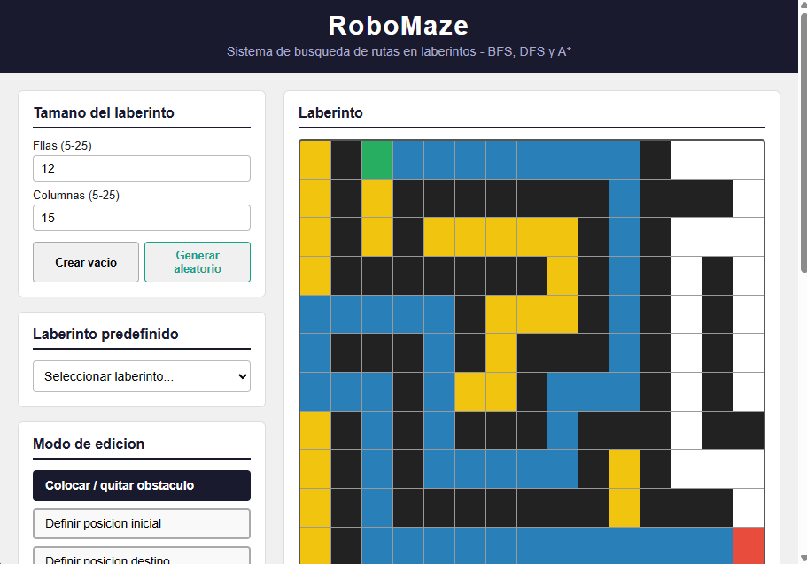
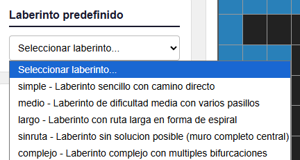
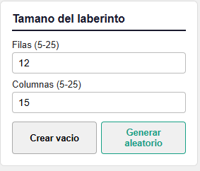
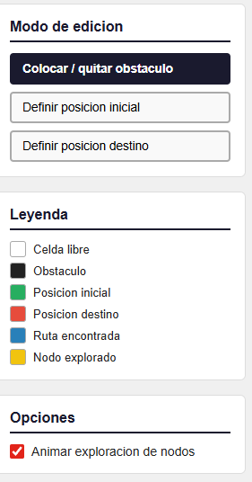
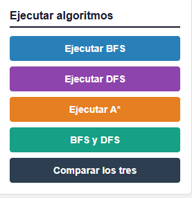
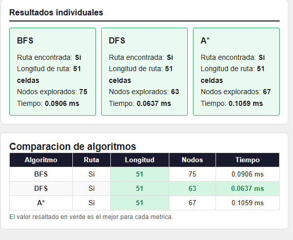

# Manual de Usuario - RoboMaze

**Proyecto:** RoboMaze - Sistema de busqueda de rutas en laberintos  
**Curso:** Inteligencia Artificial 1 - Vacaciones primer semestre 2026  
**Universidad:** Universidad de San Carlos de Guatemala  
**Autor:** Joaquin Emmanuel Aldair Coromac Huezo - 201903873  

---

## Requisitos previos

- Python 3.11 o superior instalado en el sistema.
- Pip actualizado: `python -m pip install --upgrade pip`
- Navegador web actualizado (Chrome, Firefox, Edge o equivalente).
- Conexion a internet no requerida en modo local.

---

## Instalacion del backend

### Paso 1: Abrir una terminal

Abra una terminal (PowerShell, CMD o bash) y navegue hasta la carpeta raiz del proyecto (`robomaze/`).

### Paso 2: Entrar a la carpeta backend

```
cd backend
```

### Paso 3: Crear el entorno virtual

```
python -m venv venv
```

### Paso 4: Activar el entorno virtual

En Windows:
```
venv\Scripts\activate
```

En Linux / macOS:
```
source venv/bin/activate
```

### Paso 5: Instalar dependencias

```
pip install -r requirements.txt
```

### Paso 6: Iniciar el servidor

```
uvicorn app.main:app --reload --port 8000
```

Si el servidor inicia correctamente vera en la terminal:

```
INFO:     Uvicorn running on http://127.0.0.1:8000 (Press CTRL+C to quit)
```

La documentacion interactiva de la API estara disponible en `http://localhost:8000/docs`.

---

## Uso del frontend

Abra el archivo `frontend/index.html` directamente en el navegador (doble clic o arrastrarlo al navegador). No se requiere instalacion adicional.

Asegurese de que el backend este en ejecucion antes de abrir el frontend, ya que la interfaz se conecta automaticamente a `http://localhost:8000`.

---

## Como usar el sistema

### 1. Vista general de la interfaz

Al abrir la aplicacion vera dos paneles: el panel de configuracion a la izquierda y el laberinto con los resultados a la derecha.



*Captura 1: Vista general de RoboMaze al iniciar. El panel izquierdo contiene los controles y el derecho muestra la cuadricula.*

---

### 2. Cargar un laberinto predefinido

Al iniciar la aplicacion, el sistema descarga automaticamente los 5 laberintos predefinidos desde la API y los carga en el selector. Seleccione uno de la lista para cargarlo en la cuadricula.

Los laberintos disponibles son:

| Nombre    | Descripcion                                         |
|-----------|-----------------------------------------------------|
| simple    | Camino directo con pocos obstaculos                 |
| medio     | Dificultad media con varios pasillos                |
| largo     | Ruta larga en forma de espiral                      |
| sinruta   | Laberinto sin solucion posible (muro central)       |
| complejo  | Multiples bifurcaciones y obstaculos                |




---

### 3. Configurar el tamano del laberinto

En el panel "Tamano del laberinto" ingrese el numero de filas y columnas deseado (entre 5 y 25). Luego use uno de los dos botones:

- **Crear vacio**: genera una cuadricula en blanco con el tamano indicado para editarla manualmente.
- **Generar aleatorio**: solicita a la API un laberinto generado con el algoritmo Recursive Backtracker. El inicio y destino se asignan automaticamente.




---

### 4. Editar el laberinto manualmente

Use los botones del panel "Modo de edicion" para cambiar la accion que realiza cada clic sobre la cuadricula:

- **Colocar / quitar obstaculo**: convierte una celda libre en obstaculo (negro) o viceversa.
- **Definir posicion inicial**: el siguiente clic marca la celda como punto de partida (verde).
- **Definir posicion destino**: el siguiente clic marca la celda como punto de llegada (rojo).

El boton del modo activo aparece resaltado en azul oscuro.



*Captura 4: Modo "Colocar / quitar obstaculo" activo. Se puede ver el inicio en verde, el destino en rojo y obstaculos en negro.*

---

### 5. Activar la animacion de exploracion

En el panel "Opciones", marque la casilla **Animar exploracion de nodos** para ver, de forma secuencial, como el algoritmo visita cada celda (en amarillo) antes de mostrar la ruta final (en azul). Si la casilla no esta marcada, el resultado se muestra de forma instantanea.


---

### 6. Ejecutar los algoritmos

Haga clic en uno de los botones del panel "Ejecutar algoritmos":

| Boton              | Accion                                                             |
|--------------------|--------------------------------------------------------------------|
| Ejecutar BFS       | Ruta optima (mas corta) con Breadth-First Search                   |
| Ejecutar DFS       | Ruta con Depth-First Search (puede no ser la mas corta)            |
| Ejecutar A*        | Ruta optima con heuristica Manhattan (explora menos nodos que BFS) |
| BFS y DFS          | Ejecuta ambos y muestra los dos paneles de resultado               |
| Comparar los tres  | Ejecuta BFS, DFS y A* y muestra tabla comparativa                  |

Si no se ha definido el inicio o el destino, aparecera un mensaje de error en rojo en la parte superior del laberinto.




---

### 7. Leer los resultados individuales

El panel "Resultados individuales" muestra, para cada algoritmo ejecutado:

- Si se encontro ruta o no.
- Longitud de la ruta (cantidad de celdas, incluyendo inicio y destino).
- Nodos explorados durante la busqueda.
- Tiempo de ejecucion en milisegundos.

Si no existe ruta, el panel aparece en rojo con el mensaje "Sin ruta disponible."




---

### 8. Ver la tabla comparativa

Al usar el boton "Comparar los tres", aparece debajo de los resultados individuales una tabla con los tres algoritmos. El valor resaltado en verde es el mejor para cada metrica.

---

## Leyenda de colores de la cuadricula

| Color        | Significado           |
|--------------|-----------------------|
| Blanco       | Celda libre           |
| Negro        | Obstaculo             |
| Verde        | Posicion inicial      |
| Rojo         | Posicion destino      |
| Azul         | Ruta encontrada       |
| Amarillo     | Nodo explorado (animacion) |

---

## frecuentes

**El frontend no carga los laberintos predefinidos.**  
Asegurese de que el backend este en ejecucion en `http://localhost:8000`. Si usa un navegador con restricciones CORS estrictas, sirva el frontend con un servidor local como `python -m http.server 5500` desde la carpeta `frontend/`.

**La animacion es muy rapida o muy lenta.**  
La velocidad de animacion es fija en 20 ms por nodo. Para laberintos grandes (20x25) con muchos nodos explorados puede tardar varios segundos. Desmarque la casilla de animacion para ver el resultado instantaneamente.

**El boton "Generar aleatorio" no hace nada.**  
Verifique que el backend este activo y que el endpoint `GET /maze/generate` responda correctamente en `http://localhost:8000/docs`.
